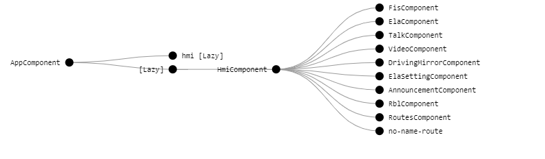

= GUI Dokumentation für MMI  : Frontend

// asciidoc settings for DE (German)
// ==================================
// toc-title definition MUST follow document title without blank line!
:toc-title: Inhaltsverzeichnis

// enable table-of-contents
:toc:
:sectanchors:
:sectnums:

:caution-caption: Achtung
:important-caption: Wichtig
:note-caption: Hinweis
:tip-caption: Tip
:warning-caption: Warnung

:appendix-caption: Anhang
:example-caption: Beispiel
:figure-caption: Abbildung
:table-caption: Tabelle

// where are images located?
:imagesdir: ./

[[section-introduction-and-goals]]
==	Konzept MMI Komponenten
Strukturierung nach MMI Spezifikation

Zurzeit wird unsere App, so geschnitten :

* 1 Module
* 9 Haupt-komponente
* weitere einzel-komponente (noch zu ergänzen)

* Services

... Ein Haupt-Komponent besteht aus mehrere Komponente. könnte auch mit der Zeit, und je nachdem die Software-Anforderungen sich entwickeln , als Modul umgewandelt

.Beispiel Vorschlag Struktur.

=== Module

* HMI (Human Machin Interface / Multi media Interface)

=== Haupt-Komponent
* FIS
* Ela
* Talk
* Video
* Driving
* ELA-Settings
* Announcement
* RBL
* Routes

=== Einzel-Komponent

* SoftKey
* StatusBox
* Start-Display (Einschalten Ansicht)
* Vehicle
* Itinerary

=== Service
* sharedService

